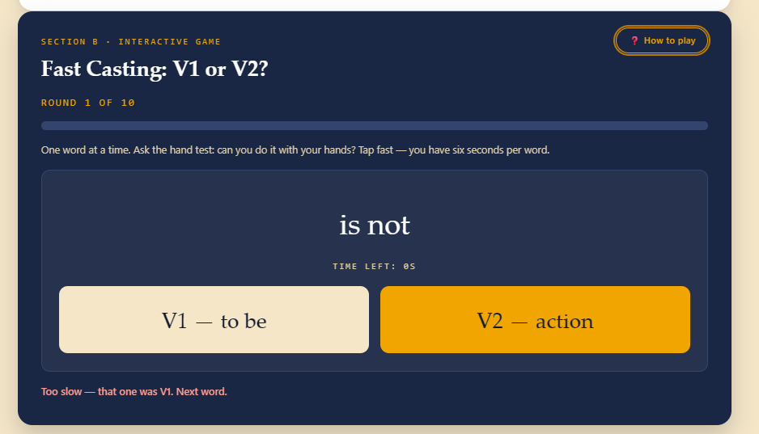
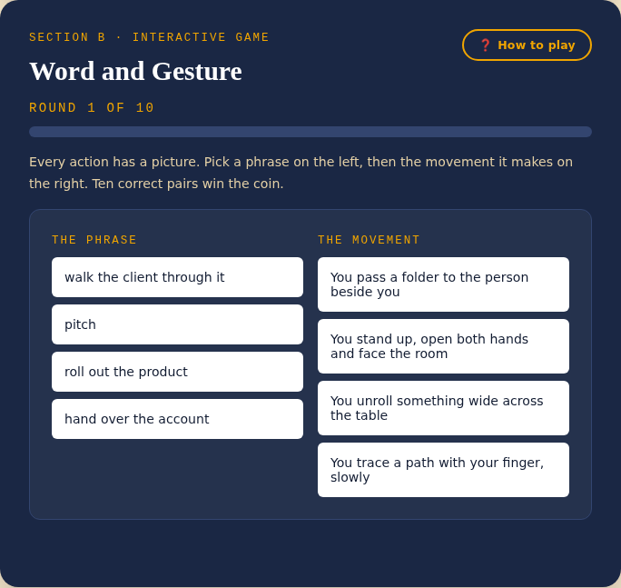

# The Nine Keys of Simi Valley — Site Instructions

*A gamified English treasure hunt built on the V1 / V2 / SVN method (Alternative Grammar), by Maria "Marita" Eborn.*

---

## 1. Purpose of the site

This site is an interactive **business-English trainer** disguised as a treasure hunt. Instead of grammar tables, the player walks through nine real locations in **Simi Valley, California**, each one hiding a physical object and a mini-game that drills one grammar concept from the **V1 / V2 / SVN** teaching method:

- **V1** — the verb *to be* (nicknamed "the Godfather": strong, needs no helper, only ever followed by a noun).
- **V2** — every action verb ("weak" on its own, needs a helper — Do / Does / Did / Will — to ask a question).
- **SVN** — the "Rule of Seven": Subject + Verb + Noun, the sentence shape behind roughly 95% of English answers.

The teaching philosophy is **TPR (Total Physical Response)**: pairing a new word with a movement, an image, or a concrete workplace scenario trains fast recall instead of slow translation, so the player *produces* English instead of merely recognising it.

The site is fully playable in **English, Spanish, and Portuguese** — but the language switch only affects instructions and interface text. All learning content (the words, sentences, and examples the player is actually tested on) always stays in English, since that is the language being taught.

---

## 2. How the hunt works

1. **Home / Map** — a grid of nine location cards. Each shows its place name, its grammar concept, and whether it has been visited.
2. **Pick a location** — opens a two-part page:
   - **Section A · Theory** — a short reading panel that explains the grammar concept for that stop, with diagrams and callouts.
   - **Section B · Interactive game** — a 10-round mini-game that drills the same concept. Clearing all 10 rounds unlocks the object hidden at that location.
3. **Collect all nine objects** to unlock the **Final Challenge**, which reveals a final code word built from the nine objects' letters.
4. **Progress is saved automatically** in the browser's local storage (no login needed). The **Reset Hunt** button (top right of the header) clears all progress after a confirmation pop-up.
5. **Credits** page (left menu) explains the teaching method, the real Simi Valley locations, the fictional framing, and gives credit to the method's author.

---

## 3. Anatomy of a location page

Every one of the nine location pages follows the same structure.

### Section A — Theoretical framework
A reading panel with:
- A headline framing the problem the concept solves (e.g. *"Every English verb is one of two characters"*).
- One or two explanatory paragraphs, sometimes with a simple diagram (SVG).
- A callout box with the key takeaway.
- A short bullet list of what changes in a real business conversation once the concept is learned.
- An "At this location" callout that ties the grammar idea to the object hidden there.
- An **"I'm ready — start the game!"** button that reveals Section B.

### Section B — Interactive game
Once started, every game shares the same shell:

- **A "How to play" button**, top-right of the card. It opens a pop-up with the game's instructions plus one worked example, closed with an **OK** button.
- **Round counter** ("Round 1 of 10") and a progress bar.
- **A one-line instruction** summarising the round's task.
- **The game board** itself (varies by game — see the table below).
- **A feedback line** confirming or correcting each answer.
- **A reward card**, shown after round 10, revealing the object and its letter.

Two examples of the game shell, showing different board types:

*"Fast Casting: V1 or V2?" (Location 2) — a speed-tap board. Note the **How to play** button in the top-right corner.*

*"Word and Gesture" (Location 1) — a matching board: pick a phrase on the left, then the movement it draws on the right.*

### The "How to play" pop-up
Clicking **How to play** on any game opens a modal with:
1. The same plain-language instructions shown under the round counter.
2. One concrete, worked **example** of a correct round (always in English, since it is teaching content).
3. An **OK** button that closes the pop-up and returns focus to the game.

The button label, pop-up title, and "Example" label are translated into the active interface language; the example itself is not.

---

## 4. The nine locations

| # | Location | Concept | Game | Object |
|---|----------|---------|------|--------|
| 1 | Ronald Reagan Presidential Library | Movement First | Word and Gesture | 🪙 Silver Speech Coin |
| 2 | Corriganville Park | Two Kinds of Verb | Fast Casting: V1 or V2? | 🎞️ Ironwood Film Reel |
| 3 | Strathearn Historical Park | The Rule of Seven | Raise the Frame | 🏮 Miner's Brass Lantern |
| 4 | Santa Susana Depot | V1 in Detail | Fill the Timetable | 🚂 Iron Rail Whistle |
| 5 | Chumash Indian Museum | V2 in Detail | Reweave the Sentence | 🧺 Valley Rain Basket |
| 6 | Rocky Peak Park | The Other Helpers | Five Gates | 🗝️ Amber Sandstone Key |
| 7 | Mount McCoy Cross | The Small Rules | Ring the Bell | 🔔 Hilltop Bell |
| 8 | Simi Valley Cultural Arts Center | The Sound of American English | Take the Stage | 🎭 Echo Stage Mask |
| 9 | Rancho Simi Community Park | Words You Can Actually Use | Open the Refrigerator | 🌿 Yucca Seed Medallion |

Details for each stop follow below.

### 1 · Ronald Reagan Presidential Library — Movement First
- **Theory:** *"Why you already know more English than you can speak."* Reading and understanding a word (passive vocabulary) is not the same skill as producing it in real time (active vocabulary). TPR closes that gap by attaching every new word to a movement or image before it becomes a rule.
- **Game — Word and Gesture:** Every action has a picture. Pick a phrase on the left, then the movement it makes on the right. Ten correct pairs win the coin.
- **Example:** *sign the contract → You move your hand across a page and stop.*

### 2 · Corriganville Park — Two Kinds of Verb
- **Theory:** *"Every English verb is one of two characters."* V1 (the verb *to be*) is the strong "Godfather" that never needs a helper; V2 (every action verb) is "weak" and always needs Do / Does / Did / Will to ask a question. The quick test: can you physically do it with your hands? If yes, it's V2.
- **Game — Fast Casting: V1 or V2?:** One word at a time. Ask the hand test: can you do it with your hands? Tap fast — you have six seconds per word.
- **Example:** *launch → V2, an action verb (needs Do / Does / Did / Will). is → V1, no helper needed.*

### 3 · Strathearn Historical Park — The Rule of Seven
- **Theory:** *"One shape covers almost every answer you will give."* Subject + Verb + Noun (SVN) is the sentence frame behind roughly 95% of spoken English answers.
- **Game — Raise the Frame:** Build the sentence in the order Subject → Verb → Noun. Drag the blocks, or click them — both work. Ten correct frames win the lantern.
- **Example:** *The team | presents | the new pricing. → Subject, then V2, then the noun.*

### 4 · Santa Susana Depot — V1 in Detail
- **Theory:** *"Six words, three times, no exceptions."* V1 has only six forms across present, past and future (am / is / are / was / were / will be), and the negative always places "not" right after V1.
- **Game — Fill the Timetable:** Fill the gap with the right form of V1: am, is, are, was, were or will be. Ten correct answers win the whistle.
- **Example:** *The proposal ___ ready for Monday. → is (present, singular subject).*

### 5 · Chumash Indian Museum — V2 in Detail
- **Theory:** *"Weak verbs, and the three helpers that carry them."* V2 leans on Did (past), Do/Does (present) and Will (future) to ask questions and to negate — the verb itself always stays in its plain form once a helper is in front of it.
- **Game — Reweave the Sentence:** Rewrite each sentence as the task asks (question, negative, or natural affirmative answer). Type your answer and check it. Ten correct rewrites win the basket.
- **Example:** *The client approved the budget. → Did the client approve the budget?*

### 6 · Rocky Peak Park — The Other Helpers
- **Theory:** *"Five words that decide how you sound in a room."* Can, Could, May, Should and Must each carry a different register — from an everyday favor to a board-room obligation — independent of tense.
- **Game — Five Gates:** Choose the helper that matches the situation. Register matters as much as grammar. Ten correct answers win the key.
- **Example:** *We ___ deliver the report before Friday. → must (a hard deadline, no room to negotiate).*

### 7 · Mount McCoy Cross — The Small Rules
- **Theory:** *"Five small rules that clean up your English."* Prepositions of place and time (at / on / in / under), adjectives vs. adverbs, "Let's" + V2, since vs. from…to, and the "-tion → shun" pronunciation pattern.
- **Game — Ring the Bell:** Read the flashcard, say your answer out loud, then flip it. Rate yourself honestly — only the cards you truly knew move you forward. Ten of those win the bell.
- **Example:** *The call starts ___ 2:00. → at 2:00 (an exact point in time).*

### 8 · Simi Valley Cultural Arts Center — The Sound of American English
- **Theory:** *"Two sounds carry most of the accent."* The growling American "R", the long, held "E", and the "-tion → shun" ending cover most of what makes American English sound native.
- **Game — Take the Stage:** Ten rounds on stage. Speak the word if your browser's microphone is available, or switch to a listening round and name the sound family.
- **Example:** *quarter → Two growls: quar-ter (the "Angry dog R").*

### 9 · Rancho Simi Community Park — Words You Can Actually Use
- **Theory:** *"A full refrigerator is not a meal."* Having a large passive vocabulary is not useful if the words stay "hidden" — the personal-dictionary technique (write it down, tag its part of speech, write your own sentence, learn its collocations) turns a recognised word into an active one.
- **Game — Open the Refrigerator:** Each business scenario is missing one working word. Type it. The first letter is on the table, and near-synonyms are accepted where they really fit.
- **Example:** *Sales came in below plan, so we had to revise the ___ for the next two quarters. → forecast (Noun).*

---

## 5. Other features

- **Language switcher** (top-right of the header): toggles the interface between English, Spanish and Portuguese. Instructions, buttons and feedback change language; the English words, sentences and examples being taught do not.
- **Reset Hunt** (header button): opens a confirmation pop-up before clearing every collected object and returning all nine locations to "not visited." This cannot be undone.
- **Final Challenge**: appears in the left menu only once all nine objects are collected. It reveals the nine letters and the final code word.
- **Credits page** (left menu): explains that the V1 / V2 / SVN method was developed by **Maria "Marita" Eborn** (bilingual editor, academic teacher, founder of educational ventures, Simi Valley, California), that the nine real-world locations are genuine Simi Valley landmarks while the objects and the Valley Archivist storyline are fiction, and how session progress is stored locally in the browser.

---

## 6. Quick reference: game mechanics by location

| Location | Mechanic type |
|---|---|
| 1 — Word and Gesture | Two-column matching |
| 2 — Fast Casting | Timed two-button tap |
| 3 — Raise the Frame | Drag-and-drop / click-to-order sentence builder |
| 4 — Fill the Timetable | Fill-in-the-blank text input |
| 5 — Reweave the Sentence | Sentence rewrite, typed and checked |
| 6 — Five Gates | Multiple choice |
| 7 — Ring the Bell | Self-graded flashcards |
| 8 — Take the Stage | Speech recognition / listening round |
| 9 — Open the Refrigerator | Fill-in-the-blank with progressive hints |
